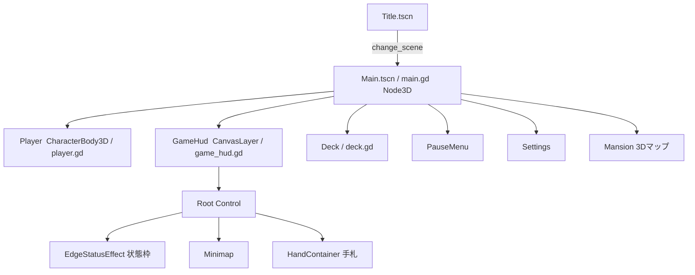
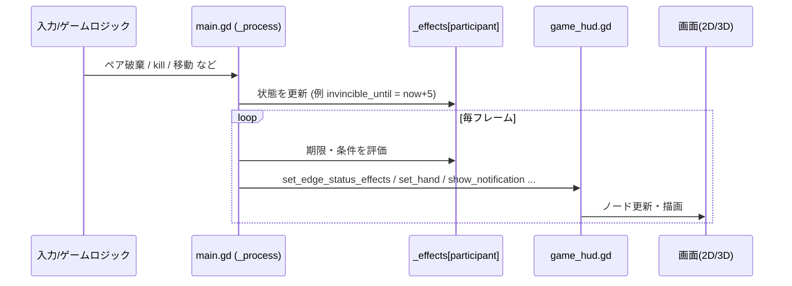

# アーキテクチャ (Architecture)

「どう作られているか」を説明する技術ドキュメント。ゲーム仕様は [REQUIREMENTS.md](REQUIREMENTS.md)。

## 全体像

- エンジン: **Godot 4.6 / Forward+**。
- 言語: **GDScript**。
- 構成: `main.gd` がゲームの司令塔で、毎フレーム状態を計算し、表示専用の `GameHud` に反映する**ポーリング型**。ゲームロジックは `main.gd` に集約している。

## ディレクトリ構成（scripts/）

役割別に分割している。`main.gd` はエントリの司令塔として直下に置く。

```
scripts/
  main.gd                       … エントリの司令塔
  config/     game_config.gd
  network/    network_manager  eos_manager  eos_lobby_manager   … 通信バックエンド(autoload)
  managers/   deck  mansion_builder                             … 調整役・システム系(今後 main から抽出)
  ui/         title settings pause_menu lobby waiting_room tutorial
              game_hud minimap item_slot card_view
  entities/   player  computer  homing_missile                 … 3Dアクター
  effects/    edge_status_effect                                … 演出
  util/       hand_sorter
```

## Autoload（グローバル）

`project.godot` の `[autoload]` に登録。どのシーンからも参照できる。

| Autoload | 実体 | 役割 |
|---|---|---|
| `GameConfig` | `scripts/config/game_config.gd` | 設定・多言語テキスト・ゲームパラメータ（マップ, CPU数, デッキ枚数, 制限時間 等） |
| `NetworkManager` | `scripts/network/network_manager.gd` | ENet による host/join（LAN直結） |
| `EOSManager` | `scripts/network/eos_manager.gd` | EOS 初期化・ログイン |
| `EOSLobbyManager` | `scripts/network/eos_lobby_manager.gd` | EOS ロビーの作成/検索/参加 |
| `HPlatform`, `HAuth`, `HLobbies`, `HP2P` … | EOSアドオン | Epic Online Services SDK ラッパー（`addons/epic-online-services-godot`） |

## シーン構成（実行時ツリー）



- **Title.tscn**（エントリ, `main_scene`）: メニュー・モード選択・EOSログイン・ロビー。
- **Main.tscn / main.gd**: ゲーム本体（Node3D）。参加者（Player + CPU）を生成し、進行を統括。
- **GameHud（CanvasLayer）**: 2Dオーバーレイ。ノードはコードで動的生成している。

## 処理フロー（状態 → 画面）

`main.gd` が状態を持ち、毎フレーム `game_hud.set_*/show_*` を呼んで反映する。HUD 自身はロジックを持たない受け口。



代表的な入口関数（`main.gd`）:

| 関数 | 役割 |
|---|---|
| `_activate_pair_ability(participant, rank)` | 能力発動（`_effects` 更新・アイテム付与・3D見た目切替・文字通知） |
| `_perform_kill_with_options(...)` / `_show_kill_notifications(...)` | kill 処理と通知 |
| `_update_player_edge_status_effects()` | joker/無敵/バリア を HUD の状態枠へ反映 |
| `_on_player_hand_changed(cards)` | 手札変化を HUD に反映 |

## 状態モデル

参加者ごとの状態は **`_effects[participant]`（Dictionary）＋時刻**で表現する（`main.gd`）。

```gdscript
_effects[participant] = {
    "invincible_until": 123.4,   # この時刻まで無敵
    "barrier_charges": 1,
    "scythe_until": 130.0,
    "invisible_until": ...,
    "enhance_next_ability": true,
    ...
}
```

- 判定は「`_now()` が `*_until` を超えたか」で行う時間ベース。状態はキーを増やして拡張する。

## 表現（見た目）の手段

現在、演出を出す手段は次の3つ。

1. **画面端の状態枠** … joker所持 / 無敵 / バリア（`edge_status_effect.gd`, Control 描画）。
2. **中央のテキスト通知** … `game_hud.show_notification(text)`。キル・能力・各種イベントの通知に使用。
3. **3Dキャラのマテリアル** … `player.gd` の `set_gold_outline`（無敵=金）/ `set_barrier_active`（球）/ `set_invisible`。

## ネットワーク

- **LAN直結**: `NetworkManager`（ENet, host/join）。`is_online` で分岐、`rpc` / `rpc_id` で同期。
- **EOS**: `EOSManager`（初期化・ログイン）＋ `EOSLobbyManager`（ロビー）。認証情報が無い環境では自動的に無効化され、シングル/LAN は動作する。
- CPU（AI）参加者はローカルで処理。

<a id="secrets"></a>
## 秘密情報の扱い（Secrets）

**現状（事実）**
- `eos_credentials.local.cfg` は `.gitignore` 済み。`eos_manager.gd` がこのファイルを読み込み、無ければ EOS を無効化（シングル/LAN は動作）。

**未決定（TODO）**: 複数人での安全な共有方法、公開リポジトリでの扱い、開発用/本番用認証の分離方針は未定。

## 主要ファイル早見表

| ファイル | 役割 |
|---|---|
| `scripts/main.gd` | ゲーム司令塔（進行・状態・HUD反映） |
| `scripts/ui/game_hud.gd` | 2D HUD（表示専用の受け口） |
| `scripts/entities/player.gd` | プレイヤー3D（移動・3D見た目） |
| `scripts/config/game_config.gd` | 設定・多言語・パラメータ |
| `scripts/managers/deck.gd` | 山札・カード配布 |
| `scripts/network/network_manager.gd` | ENet 通信 |
| `scripts/network/eos_manager.gd` / `eos_lobby_manager.gd` | EOS |
